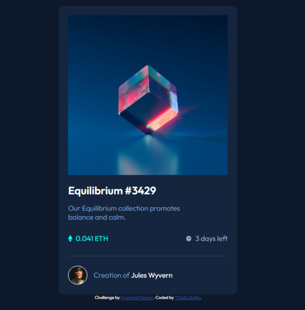

# Frontend Mentor - NFT preview card component solution

This is a solution to the [NFT preview card component challenge on Frontend Mentor](https://www.frontendmentor.io/challenges/nft-preview-card-component-SbdUL_w0U). Frontend Mentor challenges help you improve your coding skills by building realistic projects. 

## Table of contents

- [Overview](#the-overview)
  - Developing the mobile design and desktop design of the NFT preview card component

- [The challenge](#the-challenge)
  - Mobile view and desktop for different device screen sizes

- [Screenshot](#screenshot)

  

[Links](#links)

- [My process](#my-process)
  - [Built with](#built-with)
    - HTML and CSS
  - [What I learned](#what-i-learned)
    - Responsive web design
    - CSS positioning

- [Author](#author)
  - Titilola Shittu
- [Acknowledgments](#acknowledgments)
  - Frontend Mentor

### Links

- Solution URL: [Add solution URL here](https://your-solution-url.com)
- Live Site URL: [Add live site URL here](https://your-live-site-url.com)

## My process

### Built with

- Semantic HTML5 markup
- CSS custom properties
- Flexbox

## Author

- LinkedIn - [Titilola Shittu](https://www.linkedin.com/in/titilolashittu/)
- Frontend Mentor - [@Lhorla](https://www.frontendmentor.io/profile/lhorla)
- Twitter - [@Errbodylovslola](https://www.twitter.com/errbodylovslola)
