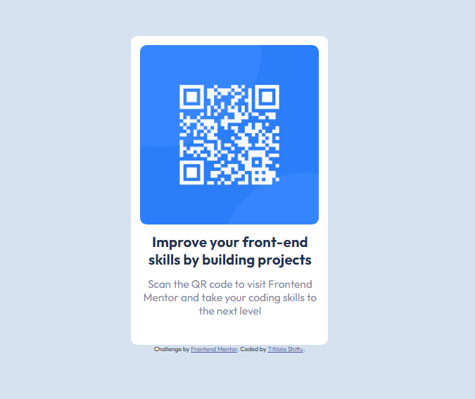

# Frontend Mentor - QR code component solution

This is a solution to the [QR code component challenge on Frontend Mentor](https://www.frontendmentor.io/challenges/qr-code-component-iux_sIO_H/hub/qr-code-component-_HheZlO8N). Frontend Mentor challenges help you improve your coding skills by building realistic projects. 

## Table of contents

- [Overview](#the-overview)
  - Developing the mobile design and desktop design of the QR code component

- [The challenge](#the-challenge)
  - Mobile view and desktop for different device screen sizes

- [Screenshot](#screenshot)

  

[Links](#links)

- [My process](#my-process)
  - [Built with](#built-with)
    - HTML and CSS
  - [What I learned](#what-i-learned)
    - Responsive web design
    - HTML semantic tags
    - flex

- [Author](#author)
  - Titilola Shittu
- [Acknowledgments](#acknowledgments)
  - Frontend Mentor

### Links

- Solution URL: [Add solution URL here](https://www.frontendmentor.io/solutions/nftpreviewcardcomponent-oFOoL3yFP)

- Live Site URL: [Add live site URL here](https://frontendmentorprojects.netlify.app/qr-code-component-main/index.html)

## My process

### Built with

- Semantic HTML5 markup
- CSS custom properties
- Flexbox

## Author

- LinkedIn - [Titilola Shittu](https://www.linkedin.com/in/titilolashittu/)
- Frontend Mentor - [@Lhorla](https://www.frontendmentor.io/profile/lhorla)
- Twitter - [@Errbodylovslola](https://www.twitter.com/errbodylovslola)
